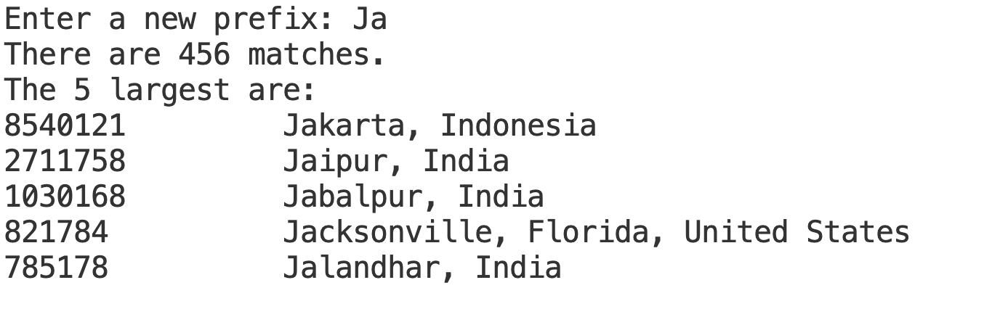

# Autocomplete

## Key Terms and Concepts

* `Comparable` and `Comparator` - Interfaces used to order objects in Java based on natural and alternative ordering, respectively.
* Autocomplete - A system where a program identifies likely results based on a prefix typed by the user.

## Description

This week, we will be implementing a program which autocompletes phrases based on a reference file of terms and associated weights. After you type a phrase, common words and phrases beginning with what you typed will appear in decreasing order of weight. This autocomplete will only display a limited number of completions. Otherwise, the user would see an unmanageable number of possibilities and the autocomplete would be more confusing than useful.

For example, let's imagine we have a file with city names ordered by frequency of visitors. A user of our program might specify they want to see the destinations starting with `Ja`. Because there are quite a few of these, we will only show a certain maximum number, say the five most popular:



Our program will be built in such a way that it can work with any reference file as long as that file has strings that represent some sort of key (e.g., an English word) and numbers that are the associated weight (e.g., frequency of appearance in everyday speech). We provide you with almost all classes you will need to implement an autocomplete program. Let's see the classes in the order you will need to implement them.

## Classes

### `Term`

You should first implement `Term`. An object of this class represents a pair of a `key` (represented as a `String`) and a `weight` (represented as a `long` – the frequencies can be large, so `int` might not be large enough).

1. As always, start by filling the constructor and instantiating/initializing any instance variables you will need. The instance variables should be immutable (no changes allowed to the `key` or `weight` fields after a `Term` object has been instantiated, that is no setter methods should be provided).

2. The class implements the interface `Comparable<Term>`, and thus it must include the `compareTo` method. For now, it returns `0`, but you need to fix this to compare this `Term` with that `Term` object based on their keys.

3. The class should also override the `toString` method so you can easily print the `key` and `weight` of a term.

4. We also ask you to implement two static methods that return `Comparators`. These can be static because they don’t depend on the instance variables of the `Term`. They return `Comparator`s that can be used to compare any two `Terms` in alternate ways.

    * The first method, `byReverseWeightOrder` should return a comparator that has a `compare` method that ignores the `key` field, but compares the `weights` in reverse order by size. That is, if used during sorting, terms with higher weights would occur before those elements with smaller weights.

    * The second static method, `byPrefixOrder(int r)`, returns a comparator with a `compare` method that only considers the first `r` characters of the `key` field, and represents the usual lexicographic order. Thus if `r` is 3, the term with `key` `"hello"` would come before `"hopper"`, but `"hello"` and `"help"` would be considered equal (because their first three characters are the same).

Here is a recipe for how to implement `Comparator`s in Java using lambda expressions:

```java
public static Comparator<Term> nameOfMethod() {
    return (Term t1, Term t2) -> {
        //return 0, negative, or positive numbers based on comparing t1 and t2 in certain ways
    };
}
```

If you have an `ArrayList` that you want to sort based on a specific comparator, you would write `Collections.sort(list, Term.nameOfMethod());`

Test the methods in this class thoroughly (using `JUnit`s or a `main` method) before proceeding to the other classes. We will want to see those tests. We suggest you build a small `ArrayList` of `Terms` and then sort them in several different ways using the comparators returned by the static methods as shown above.

### `BinarySearchForAll`

Next, you should implement the class `BinarySearchForAll`. The class is a bit unusual in that it has no instance variables and only provides two static public methods that take an item and find matching items in a list based on a comparator.

1. The first method, `firstIndexOf`, finds the index of the first element in a list that equals, according to the given comparator, the provided item.
2. The second, `lastIndexOf`, finds the index of the last element that equals, according to the comparator, the provided item.

**You should not use a linear search to find elements in the list.** Both methods will apply a binary search ($O(log n)$ instead of $O(n)$ runtime complexity!).

The idea is that we start in the  middle of a list and compare that element with the provided item. If our item is smaller than the middle element, we know that if it exists in the list, it has to be in the left half of the list. If it is larger, it has to be on the right side. You can either implement this binary search iteratively or recursively. At some point, you will either be certain that the item doesn't exist in the list (the convention is to return -1), or you found a matching item and you return its index. Because there are potential matches on the left and right of the item, `firstIndexOf` will have to find the index of the first match, while `lastIndexOf` will have to find the index of the last match.

When you implement your two binary search methods, **do not use the `equals` method to check for a match.** Instead, see if the `compare` method of the provided comparator returns a `0`. The problem that we have is that the comparator may not be consistent with the `equals` method of the objects we are comparing. If we knew what comparator we would be using for comparing terms, then we could override `equals`, but in this case we can use different comparators at different times.

Once you implement these methods, build `JUnit` tests or implement a `main` method to test them. We will want to see those tests. We suggest you build an `ArrayList` of `Term` objects which have some overlap among the first characters of their keys, sort them by `byPrefixOrder`, and then test that indeed you return the first or last index of a matching term.

### `Autocomplete`

This class will be the place where all the pieces come together.

1. Start by populating the constructor. The constructor of the class should take in a `List<Term>` and sort it according to the `key`s of the terms.
2. Continue by implementing the `allMatches` method. Given a prefix to search, use the classes `Term` and `BinarySearchForAll` to find all (if any) matches of terms and return them in a list that has been sorted by reverse weight.

As always, use `JUnit` tests or a `main` method to check that your `allMatches` method works as intended. We will want to see those tests.

### `AutocompleteMain`

Finally, you should write a static `main` method in a class `AutocompleteMain` that takes two runtime parameters (passed in the `String args[]` array of the `main` method).

The first argument will be an `int` that determines how many matching items should be printed in response to a query, while the second is the name of the file holding the weights and keys.

The first line of the weight/key file will be an `int` specifying the number of lines of data in the file. All subsequent lines will consist of a `long` value representing the weight followed by one or more tab symbols and then a `String` representing the key. You can use a `Scanner` to read in the input. After reading in the `long` value using `nextLong()`, we suggest you read in the rest of the line using `nextLine()` and then use the `trim()` method in `String` to throw away any white space preceding or following the key. You can then package these into a value of type `Term`. The `Term`s read in should be held in an `ArrayList`.

To pass runtime arguments to your `AutocompleteMain` `main` method, go to `Run>Add configuration` on VS Code. You will see that a launch.json file will automatically be created in the hidden directory `.vscode`. Open that file and you will see something like

```json
{
    "type": "java",
    "name": "AutoCompleteMain",
    "request": "launch",
    "mainClass": "autocomplete.AutoCompleteMain",
    "projectName": "Autocomplete"
},
```

edit it to:

```json
{
    "type": "java",
    "name": "AutoCompleteMain",
    "request": "launch",
    "mainClass": "autocomplete.AutoCompleteMain",
    "projectName": "Autocomplete",
    "args": "5 cities2.txt"
},
```

where `5` is the number of matches you want to return and `cities2.txt` can be changed to whatever reference file you want to have.

Go back to the `main` method of your `AutocompleteMain`. The `args[]` `String` array passed as a parameter to your `main` has now the `5` and `cities2.txt` info you can work with. Because `5` is read as a `String` and not a number, you will want to pass it to the `Integer.parseInt` method to convert it into an `int`.

Once the file is loaded, the program should prompt the user to type in a prefix and then print the top group of matching items (both keys and weights), as shown in the Figure above. It should then prompt the user to enter another prefix. Be aware that the number of matching items may be smaller than the number specified to be returned. In that case, just print out all the matching items.

To test your program we have provided two big files, `cities.txt` and `wiktionary.txt`, and `cities2.txt`. The first two are very large so don’t print them out. For testing feel free to use `cities2.txt`.

Note that `cities.txt` contains some cities that have accented characters, which, depending on the OS (i.e. Windows) can sometimes cause problems with the `Scanner` class.  If you have troubles constructing a `Scanner` with the `cities.txt` file, you can pass in a second parameter to the constructor specifying the character encoding.  In this case "utf-8" would be good, i.e.,

```java
new Scanner(theFile, "utf-8")
```

Here is some sample output if the command line parameters are 5 and `wiktionary.txt`.

```console
Enter a new prefix: hel
There are 10 matches.
The 5 largest are:
24371200 help
23547400 held
4048780 helped
3461920 helen
3177030 hell
Enter a new prefix: pom
There are 2 matches.
The matching items are:
873729 pomp
403557 pompous
Enter a new prefix:
```

## Affordance Analysis

Dr. Kevin Lin's paper about [affordance analysis](https://ieeexplore.ieee.org/abstract/document/9620635) talks about this exact homework assignment, and in Dr. Safiya Nobel's book *[Algorithms of Oppression](https://en.wikipedia.org/wiki/Algorithms_of_Oppression)*, Dr. Nobel points out how ordering autocomplete results by frequency of searches can reproduce sexist or racist stereotypes. For instance, in 2013, the top 4 Google search autocompletes of the following things about women were:

* Women cannot: drive, be bishops, be trusted, speak in church
* Women should not: have rights, vote, work, box
* Women need to: be put in their places, know their place, be controlled, be disciplined

For what it's worth, in 2025, these autocompletes are:

* Women cannot: be colorblind, survive without men, divorce if pregnant, have it all
* Women should not: wear that which pertaineth to a man (just 1 result, but the top 4 for women should: drink how much water, listen to their husbands, clean, take creatine)
* Women need to: feel desired, be hugged, feel wanted, sleep 10 hours

An affordance analysis of this could be that choosing to weigh results simply by greatest search frequency may reinforce cultural norms and harmful power dynamics. In the affordance analysis paper, Lin writes, "The value of a computational abstraction is not only in how it directly affects end users, but also how it affects *societal systems and structures* by eroding civil and human rights." Create an `answers.txt` file to submit on Gradescope answer the following:

1. What is your reaction to this? How do the 2013 and 2025 search results compare for you? Do an autocomplete search for a different group and write the top 4 results. Is it what you expected?
2. If you were an engineer working on Google's autocomplete function, what are some ways you might change how results are presented? Would you use a different weighing metric besides search term frequency? Keep it the way it is? Something else?

## Grading

You will be graded based on the following criteria:

| Criterion                              | Points |
| :------------------------------------- | :----- |
| Autograder                             | 8      |
| Load files and user interaction        | 3      |
| Thoroughness of test code              | 2      |
| Appropriate comments + JavaDoc + style | 2      |
| Good answers.txt                       | 1      |
| Total                                  | 16     |

NOTE: Code that does not compile will not be accepted! Make sure that your code compiles before submitting it.

Acknowledgments: This assignment is based on a similar exercise developed by Matthew Drabick and Kevin Wayne at Princeton University.
